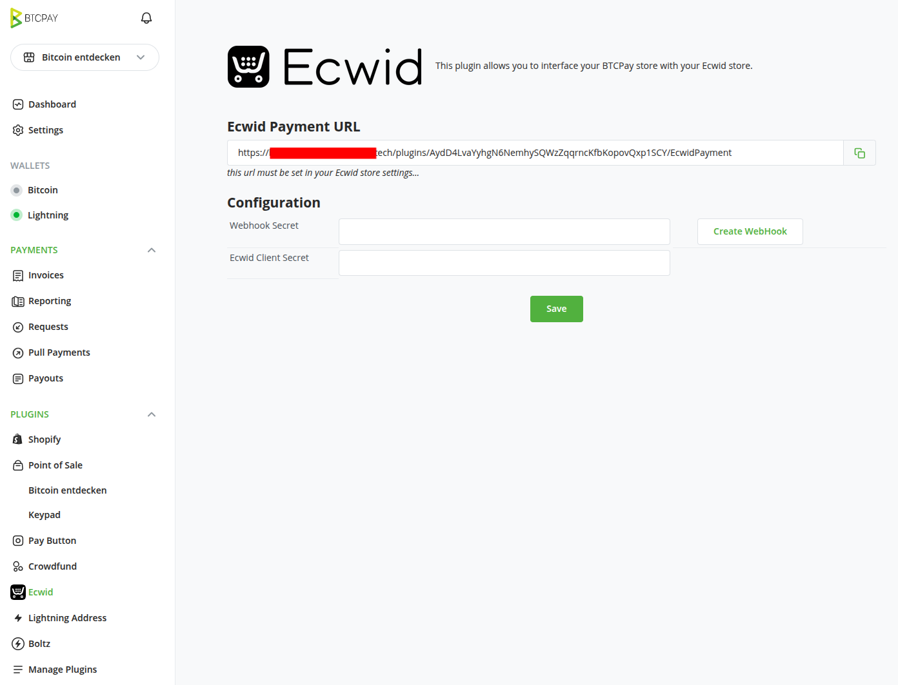

# Ecwid plugin for BTCPay Server

This plugin allows you to interface your Ecwid online store with your BTCPay Server instance, so your customers can pay with bitcoins.

## Steps to setup BTCPay as payment gateway in Ecwid:

1. Install this plugin "Ecwid plugin" on your BTCPay instance, you can find it under "Manage Plugins" (this only works on your own BTCPay Server, if you are on a 3rd party host, they need to install the plugin for the whole server)
   - After you installed the plugin select the right store and click on "Ecwid" in the left sidebar
     
     
   - It will show you a "Ecwid Payment URL" at the top, copy the shown URL, we will need it in a few steps below.
     

----- 
2. In your Ecwid store, you need to create a custom app. Follow [this link](https://my.ecwid.com/#develop-apps).
  - Click on "Create" next to "Create one more app"
    
  - Next you need to contact the Ecwid support via the support form at the bottom of that app page. Click on "Contact" button.
    
  - When you see on the screen "This Typeform has moved..." click on "Continue" to open the form.
  - And ask them to change the following settings:
    - "Access scope": we need the scope `add_payment_method` 
    - "Payment title": `Pay with Bitcoin / Lightning Network` (this will be shown to customers as payment option, can be changed to your preference)
    - "Payment URL": here enter the URL from the Plugin on BTCPay, which you copied at step 1. above. E.g. `https://BTCPAY.YOURDOMAIN.COM/plugins/STORE_ID/EcwidPayment`
    
  - After clicking "Submit" you will see a confirmation message that it takes up to 2 business days (they respond faster usually).

-----
3. Once Ecwid support has confirmed the app settings updates, we need to uninstall and install the app for changes to take effect.
   - Go back to the app overview (App -> My apps)
   - On the app we just created click on the "Details" link
   - You will see a "Uninstall" button, click on it
   - On the popup click on "Uninstall app"   
      
   
-----
4. Now we need to install the app again   
   - Click on this link [https://my.ecwid.com/#develop-apps](https://my.ecwid.com/#develop-apps)
   - Next to the created app click on "Details"   
      
   - On next screen, click on "Install" button   
      
-----
5. Now go to the app overview again and click on "Manage App" next to the app you created.
   - Scroll down to *App keys* section and click on the "Show client secret" link
   - Copy the value from the *Client secret* field
   

-----
6. Back on your BTCPay Server, select the correct store and click on the Ecwid plugin
   - Paste the value of that "Client secret" into the field "Ecwid Client Secret"
   - Click on "Save"

Congratulations! Bitcoin payments are now live on your Ecwid store.

You should now see the payment option in your Ecwid store checkout page. You can check by clicking on "Payment" on the left sidebar. Sometimes it can take a few minutes until it shows up after reinstalling the app.

 
What's new in v 1.0.2 :
- Small fixes
